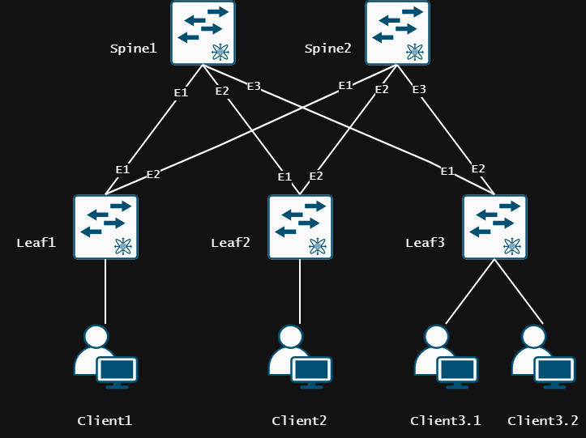

# Lab01.Основы проектирования сети
> «Существует два типа сетевых топологий: идеальная (на схеме в Visio) и реальная (работает, не трогай!)»

## 1. Цель работы
1. Собрать топологию CLOS;
2. Распределить адресное пространство для Underlay сети;
3. Зафиксировать в документации план работ, адресное пространство, схему сети, настройки.

## 2. Топология


| Device     | Hostname  | Platform        | Interface Loopback | IP network /32 |
|------------|-----------|-----------------| -------------------|----------------|
| Spine1     | S1        | Arista vEOS-lab | Loopback 1         | 192.168.0.1    |
| Spine1     | S1        | Arista vEOS-lab | Loopback 2         | 192.168.100.1  |
| Spine2     | S2        | Arista vEOS-lab | Loopback 1         | 192.168.0.2    |
| Spine2     | S2        | Arista vEOS-lab | Loopback 2         | 192.168.100.2  |
| Leaf1      | L1        | Arista vEOS-lab | Loopback 1         | 192.168.0.11   |
| Leaf1      | L1        | Arista vEOS-lab | Loopback 2         | 192.168.100.11 |
| Leaf2      | L2        | Arista vEOS-lab | Loopback 1         | 192.168.0.12   |
| Leaf2      | L2        | Arista vEOS-lab | Loopback 2         | 192.168.100.12 |
| Leaf3      | L3        | Arista vEOS-lab | Loopback 1         | 192.168.0.13   |
| Leaf3      | L3        | Arista vEOS-lab | Loopback 2         | 192.168.100.13 |

## 3. Адресный план (Underlay)

| Device1    | Interface1   | Device1 IP | Network /30 | Device2 IP | Interface2   | Device2    |
|------------|--------------|------------|-------------|------------|--------------|------------|
| Leaf1      | Ethernet1    |  10.1.1.2  |  10.1.1.0   |  10.1.1.1  | Ethernet1    | Spine1     |
| Leaf1      | Ethernet2    |  10.1.4.2  |  10.1.4.0   |  10.1.4.1  | Ethernet1    | Spine2     |
| Leaf2      | Ethernet1    |  10.1.2.2  |  10.1.2.0   |  10.1.2.1  | Ethernet1    | Spine1     |
| Leaf2      | Ethernet2    |  10.1.5.2  |  10.1.5.0   |  10.1.5.1  | Ethernet1    | Spine2     |
| Leaf3      | Ethernet1    |  10.1.3.2  |  10.1.3.0   |  10.1.3.1  | Ethernet1    | Spine1     |
| Leaf3      | Ethernet2    |  10.1.6.2  |  10.1.6.0   |  10.1.6.1  | Ethernet1    | Spine2     |

## 4. Конфигурация 

<details>
<summary> Spine1
</summary>

```
! Command: show running-config
! device: S1 (vEOS-lab, EOS-4.29.2F)
!
! boot system flash:/vEOS-lab.swi
!
no aaa root
!
transceiver qsfp default-mode 4x10G
!
service routing protocols model ribd
!
logging synchronous level all
!
hostname S1
!
spanning-tree mode none
!
interface Ethernet1
   description TO_L1
   no switchport
   ip address 10.1.1.1/30
!
interface Ethernet2
   description TO_L2
   no switchport
   ip address 10.1.2.1/30
!
interface Ethernet3
   description TO_L3
   no switchport
   ip address 10.1.3.1/30
!
interface Ethernet4
   shutdown
!
interface Ethernet5
   shutdown
!
interface Ethernet6
   shutdown
!
interface Ethernet7
   shutdown
!
interface Ethernet8
   shutdown
!
interface Loopback0
   ip address 192.168.0.1/32
!
interface Loopback1
   ip address 192.168.100.1/32
!
interface Management1
   shutdown
!
ip routing
!
end
```

</details>

<details>
<summary> Spine2
</summary>

```
! Command: show running-config
! device: S2 (vEOS-lab, EOS-4.29.2F)
!
! boot system flash:/vEOS-lab.swi
!
no aaa root
!
transceiver qsfp default-mode 4x10G
!
service routing protocols model ribd
!
logging synchronous level all
!
hostname S2
!
spanning-tree mode none
!
interface Ethernet1
   description TO_L1
   no switchport
   ip address 10.1.4.1/30
!
interface Ethernet2
   description TO_L2
   no switchport
   ip address 10.1.5.1/30
!
interface Ethernet3
   description TO_L3
   no switchport
   ip address 10.1.6.1/30
!
interface Ethernet4
   shutdown
!
interface Ethernet5
   shutdown
!
interface Ethernet6
   shutdown
!
interface Ethernet7
   shutdown
!
interface Ethernet8
   shutdown
!
interface Loopback0
   ip address 192.168.0.2/32
!
interface Loopback1
   ip address 192.168.100.2/32
!
interface Management1
   shutdown
!
ip routing
!
end
```

</details>

<details>
<summary> Leaf1
</summary>

```
! Command: show running-config
! device: L1 (vEOS-lab, EOS-4.29.2F)
!
! boot system flash:/vEOS-lab.swi
!
no aaa root
!
transceiver qsfp default-mode 4x10G
!
service routing protocols model ribd
!
logging synchronous level all
!
hostname L1
!
spanning-tree mode none
!
interface Ethernet1
   description TO_S1
   no switchport
   ip address 10.1.1.2/30
!
interface Ethernet2
   description TO_S2
   no switchport
   ip address 10.1.4.2/30
!
interface Ethernet3
   shutdown
!
interface Ethernet4
   shutdown
!
interface Ethernet5
   shutdown
!
interface Ethernet6
   shutdown
!
interface Ethernet7
   shutdown
!
interface Ethernet8
!
interface Loopback0
   ip address 192.168.0.11/32
!
interface Loopback1
   ip address 192.168.100.11/32
!
interface Management1
   shutdown
!
ip routing
!
end
```

</details>

<details>
<summary> Leaf2
</summary>

```
! Command: show running-config
! device: L2 (vEOS-lab, EOS-4.29.2F)
!
! boot system flash:/vEOS-lab.swi
!
no aaa root
!
transceiver qsfp default-mode 4x10G
!
service routing protocols model ribd
!
logging synchronous level all
!
hostname L2
!
spanning-tree mode none
!
interface Ethernet1
   description TO_S1
   no switchport
   ip address 10.1.2.2/30
!
interface Ethernet2
   description TO_S2
   no switchport
   ip address 10.1.5.2/30
!
interface Ethernet3
   shutdown
!
interface Ethernet4
   shutdown
!
interface Ethernet5
   shutdown
!
interface Ethernet6
   shutdown
!
interface Ethernet7
   shutdown
!
interface Ethernet8
!
interface Loopback0
   ip address 192.168.0.12/32
!
interface Loopback1
   ip address 192.168.100.12/32
!
interface Management1
   shutdown
!
ip routing
!
end
```

</details>

<details>
<summary> Leaf3
</summary>

```
! Command: show running-config
! device: L3 (vEOS-lab, EOS-4.29.2F)
!
! boot system flash:/vEOS-lab.swi
!
no aaa root
!
transceiver qsfp default-mode 4x10G
!
service routing protocols model ribd
!
hostname L3
!
spanning-tree mode none
!
interface Ethernet1
   description TO_S1
   no switchport
   ip address 10.1.3.2/30
!
interface Ethernet2
   description TO_S2
   no switchport
   ip address 10.1.6.2/30
!
interface Ethernet3
   shutdown
!
interface Ethernet4
   shutdown
!
interface Ethernet5
   shutdown
!
interface Ethernet6
   shutdown
!
interface Ethernet7
!
interface Ethernet8
!
interface Loopback0
   ip address 192.168.0.13/32
!
interface Loopback1
   ip address 192.168.100.13/32
!
interface Management1
   shutdown
!
ip routing
!
end
```

</details>

## 5. Проверка работоспособности топологии

<details>
<summary> Проверка доступности L1 <--> S1
</summary>

```
L1#ping 10.1.1.1 repeat 1 
PING 10.1.1.1 (10.1.1.1) 72(100) bytes of data.
80 bytes from 10.1.1.1: icmp_seq=1 ttl=64 time=70.8 ms

--- 10.1.1.1 ping statistics ---
1 packets transmitted, 1 received, 0% packet loss, time 0ms
rtt min/avg/max/mdev = 70.845/70.845/70.845/0.000 ms
```

</details>

<details>
<summary> Проверка доступности L1 <--> S2
</summary>

```
L1#ping 10.1.4.1 repeat 1
PING 10.1.4.1 (10.1.4.1) 72(100) bytes of data.
80 bytes from 10.1.4.1: icmp_seq=1 ttl=64 time=72.8 ms

--- 10.1.4.1 ping statistics ---
1 packets transmitted, 1 received, 0% packet loss, time 0ms
rtt min/avg/max/mdev = 72.877/72.877/72.877/0.000 ms
```

</details>

<details>
<summary> Проверка доступности L2 <--> S1
</summary>

```
L2#ping 10.1.2.1 repeat 1
PING 10.1.2.1 (10.1.2.1) 72(100) bytes of data.
80 bytes from 10.1.2.1: icmp_seq=1 ttl=64 time=138 ms

--- 10.1.2.1 ping statistics ---
1 packets transmitted, 1 received, 0% packet loss, time 0ms
rtt min/avg/max/mdev = 138.115/138.115/138.115/0.000 ms
```

</details>

<details>
<summary> Проверка доступности L2 <--> S2
</summary>

```
L2#ping 10.1.5.1 repeat 1
PING 10.1.5.1 (10.1.5.1) 72(100) bytes of data.
80 bytes from 10.1.5.1: icmp_seq=1 ttl=64 time=44.8 ms

--- 10.1.5.1 ping statistics ---
1 packets transmitted, 1 received, 0% packet loss, time 0ms
rtt min/avg/max/mdev = 44.867/44.867/44.867/0.000 ms
```

</details>

<details>
<summary> Проверка доступности L3 <--> S1
</summary>

```
L3#ping 10.1.3.1 repeat 1
PING 10.1.3.1 (10.1.3.1) 72(100) bytes of data.
80 bytes from 10.1.3.1: icmp_seq=1 ttl=64 time=125 ms

--- 10.1.3.1 ping statistics ---
1 packets transmitted, 1 received, 0% packet loss, time 0ms
rtt min/avg/max/mdev = 125.959/125.959/125.959/0.000 ms
```

</details>

<details>
<summary> Проверка доступности L3 <--> S2
</summary>

```
L3#ping 10.1.6.1 repeat 1
PING 10.1.6.1 (10.1.6.1) 72(100) bytes of data.
80 bytes from 10.1.6.1: icmp_seq=1 ttl=64 time=61.5 ms

--- 10.1.6.1 ping statistics ---
1 packets transmitted, 1 received, 0% packet loss, time 0ms
rtt min/avg/max/mdev = 61.529/61.529/61.529/0.000 ms
```

</details>