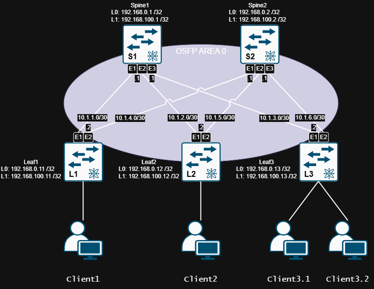

# Lab02.Построение Underlay сети (OSPF)
> «Выбирая кратчайший путь, убедись, что все участники движения знают карту дорог.»

## 1. Цель работы
1. Настроить OSPF в Underlay сети, для IP связанности между всеми сетевыми устройствами;
2. Зафиксировать в документации - план работы, адресное пространство, схему сети, конфигурацию устройств;
3. Убедиться в наличии IP связанности между устройствами в OSFP домене.

## 2. Топология


| Device     | Hostname  | Platform        | Interface Loopback | IP network /32 |
|------------|-----------|-----------------| -------------------|----------------|
| Spine1     | S1        | Arista vEOS-lab | Loopback 0         | 192.168.0.1    |
| Spine1     | S1        | Arista vEOS-lab | Loopback 1         | 192.168.100.1  |
| Spine2     | S2        | Arista vEOS-lab | Loopback 0         | 192.168.0.2    |
| Spine2     | S2        | Arista vEOS-lab | Loopback 1         | 192.168.100.2  |
| Leaf1      | L1        | Arista vEOS-lab | Loopback 0         | 192.168.0.11   |
| Leaf1      | L1        | Arista vEOS-lab | Loopback 1         | 192.168.100.11 |
| Leaf2      | L2        | Arista vEOS-lab | Loopback 0         | 192.168.0.12   |
| Leaf2      | L2        | Arista vEOS-lab | Loopback 1         | 192.168.100.12 |
| Leaf3      | L3        | Arista vEOS-lab | Loopback 0         | 192.168.0.13   |
| Leaf3      | L3        | Arista vEOS-lab | Loopback 1         | 192.168.100.13 |

## 3. Адресный план (Underlay)


| Device1    | Interface1   | Device1 IP | Network /30 | Device2 IP | Interface2   | Device2    |
|------------|--------------|------------|-------------|------------|--------------|------------|
| Leaf1      | Ethernet1    |  10.1.1.2  |  10.1.1.0   |  10.1.1.1  | Ethernet1    | Spine1     |
| Leaf1      | Ethernet2    |  10.1.4.2  |  10.1.4.0   |  10.1.4.1  | Ethernet1    | Spine2     |
| Leaf2      | Ethernet1    |  10.1.2.2  |  10.1.2.0   |  10.1.2.1  | Ethernet2    | Spine1     |
| Leaf2      | Ethernet2    |  10.1.5.2  |  10.1.5.0   |  10.1.5.1  | Ethernet2    | Spine2     |
| Leaf3      | Ethernet1    |  10.1.3.2  |  10.1.3.0   |  10.1.3.1  | Ethernet3    | Spine1     |
| Leaf3      | Ethernet2    |  10.1.6.2  |  10.1.6.0   |  10.1.6.1  | Ethernet3    | Spine2     |

## 4. Конфигурация 

<details>
<summary> Spine1
</summary>

```
#configure terminal

hostname S1
!
interface Loopback0
   ip address 192.168.0.1/32
   ip ospf area 0.0.0.0
   exit
!
interface Ethernet1
   description P2P_to_Leaf1_Eth1
   no switchport
   mtu 9214
   ip address 10.1.1.1/30
   ip ospf network point-to-point
   ip ospf area 0.0.0.0
   ip ospf authentication message-digest
   ip ospf message-digest-key 1 md5 OTUS
   bfd interval 300 min-rx 300 multiplier 3
   exit
!
interface Ethernet2
   description P2P_to_Leaf2_Eth1
   no switchport
   mtu 9214
   ip address 10.1.2.1/30
   ip ospf network point-to-point
   ip ospf area 0.0.0.0
   ip ospf authentication message-digest
   ip ospf message-digest-key 1 md5 OTUS
   bfd interval 300 min-rx 300 multiplier 3
   exit
!
interface Ethernet3
   description P2P_to_Leaf3_Eth1
   no switchport
   mtu 9214
   ip address 10.1.3.1/30
   ip ospf network point-to-point
   ip ospf area 0.0.0.0
   ip ospf authentication message-digest
   ip ospf message-digest-key 1 md5 OTUS
   bfd interval 300 min-rx 300 multiplier 3
   exit
!
router ospf 1
   router-id 192.168.0.1
   passive-interface default
   no passive-interface Ethernet1
   no passive-interface Ethernet2
   no passive-interface Ethernet3
   no passive-interface Loopback0
   max-lsa 12000
   bfd default
   log-adjacency-changes detail
   maximum-paths 4
   exit
```
</details>

[Spine1 Running-conifg ](_Spine1_running-config.txt)

<details>
<summary> Spine2
</summary>

```
#configure terminal

hostname S2
!
interface Loopback0
   ip address 192.168.0.2/32
   ip ospf area 0.0.0.0
   exit
!
interface Ethernet1
   description P2P_to_Leaf1_Eth2
   no switchport
   mtu 9214
   ip address 10.1.4.1/30
   ip ospf network point-to-point
   ip ospf area 0.0.0.0
   ip ospf authentication message-digest
   ip ospf message-digest-key 1 md5 OTUS
   bfd interval 300 min-rx 300 multiplier 3
   exit
!
interface Ethernet2
   description P2P_to_Leaf2_Eth2
   no switchport
   mtu 9214
   ip address 10.1.5.1/30
   ip ospf network point-to-point
   ip ospf area 0.0.0.0
   ip ospf authentication message-digest
   ip ospf message-digest-key 1 md5 OTUS
   bfd interval 300 min-rx 300 multiplier 3
   exit
!
interface Ethernet3
   description P2P_to_Leaf3_Eth2
   no switchport
   mtu 9214
   ip address 10.1.6.1/30
   ip ospf network point-to-point
   ip ospf area 0.0.0.0
   ip ospf authentication message-digest
   ip ospf message-digest-key 1 md5 OTUS
   bfd interval 300 min-rx 300 multiplier 3
   exit
!
router ospf 1
   router-id 192.168.0.2
   passive-interface default
   no passive-interface Ethernet1
   no passive-interface Ethernet2
   no passive-interface Ethernet3
   no passive-interface Loopback0
   max-lsa 12000
   bfd default
   log-adjacency-changes detail
   maximum-paths 4
   exit
```
</details>

[Spine2 Running-conifg ](_Spine2_running-config.txt)

<details>
<summary> Leaf1
</summary>

```
#configure terminal

hostname L1
!
interface Loopback0
   ip address 192.168.0.11/32
   ip ospf area 0.0.0.0
   exit
!
interface Ethernet1
   description P2P_to_Spine1_Eth1
   no switchport
   mtu 9214
   ip address 10.1.1.2/30
   ip ospf network point-to-point
   ip ospf area 0.0.0.0
   ip ospf authentication message-digest
   ip ospf message-digest-key 1 md5 OTUS
   bfd interval 300 min-rx 300 multiplier 3
   exit
!
interface Ethernet2
   description P2P_to_Spine2_Eth1
   no switchport
   mtu 9214
   ip address 10.1.4.2/30
   ip ospf network point-to-point
   ip ospf area 0.0.0.0
   ip ospf authentication message-digest
   ip ospf message-digest-key 1 md5 OTUS
   bfd interval 300 min-rx 300 multiplier 3
   exit
!
interface Ethernet8
   description To_Client1
   mtu 9214
   exit
!
router ospf 1
   router-id 192.168.0.11
   passive-interface default
   no passive-interface Ethernet1
   no passive-interface Ethernet2
   no passive-interface Loopback0
   max-lsa 12000
   bfd default
   log-adjacency-changes detail
   maximum-paths 4
   exit
```
</details>

[Leaf1 Running-conifg ](_Leaf1_running-config.txt)

<details>
<summary> Leaf2
</summary>

```
#configure terminal

hostname L2
!
interface Loopback0
   ip address 192.168.0.12/32
   ip ospf area 0.0.0.0
   exit
!
interface Ethernet1
   description P2P_to_Spine1_Eth2
   no switchport
   mtu 9214
   ip address 10.1.2.2/30
   ip ospf network point-to-point
   ip ospf area 0.0.0.0
   ip ospf authentication message-digest
   ip ospf message-digest-key 1 md5 OTUS
   bfd interval 300 min-rx 300 multiplier 3
   exit
!
interface Ethernet2
   description P2P_to_Spine2_Eth2
   no switchport
   mtu 9214
   ip address 10.1.5.2/30
   ip ospf network point-to-point
   ip ospf area 0.0.0.0
   ip ospf authentication message-digest
   ip ospf message-digest-key 1 md5 OTUS
   bfd interval 300 min-rx 300 multiplier 3
   exit
!
interface Ethernet8
   description To_Client2
   mtu 9214
   exit
!
router ospf 1
   router-id 192.168.0.12
   passive-interface default
   no passive-interface Ethernet1
   no passive-interface Ethernet2
   no passive-interface Loopback0
   max-lsa 12000
   bfd default
   log-adjacency-changes detail
   maximum-paths 4
   exit
```
</details>

[Leaf2 Running-conifg ](_Leaf2_running-config.txt)

<details>
<summary> Leaf3
</summary>

```
#configure terminal

hostname L3
!
interface Loopback0
   ip address 192.168.0.13/32
   ip ospf area 0.0.0.0
   exit
!
interface Ethernet1
   description P2P_to_Spine1_Eth3
   no switchport
   mtu 9214
   ip address 10.1.3.2/30
   ip ospf network point-to-point
   ip ospf area 0.0.0.0
   ip ospf authentication message-digest
   ip ospf message-digest-key 1 md5 OTUS
   bfd interval 300 min-rx 300 multiplier 3
   exit
!
interface Ethernet2
   description P2P_to_Spine2_Eth3
   no switchport
   mtu 9214
   ip address 10.1.6.2/30
   ip ospf network point-to-point
   ip ospf area 0.0.0.0
   ip ospf authentication message-digest
   ip ospf message-digest-key 1 md5 OTUS
   bfd interval 300 min-rx 300 multiplier 3
   exit
!
interface Ethernet7
   description To_Client3.1
   mtu 9214
   exit
!
interface Ethernet8
   description To_Client3.2
   mtu 9214
   exit
!
router ospf 1
   router-id 192.168.0.13
   passive-interface default
   no passive-interface Ethernet1
   no passive-interface Ethernet2
   no passive-interface Loopback0
   max-lsa 12000
   bfd default
   log-adjacency-changes detail
   maximum-paths 4
   exit
```
</details>

[Leaf3 Running-conifg ](_Leaf3_running-config.txt)

<details>
<summary> Monitoring/Debug
</summary>

```
show ip ospf neighbor
show ip ospf interface brief
show ip route ospf
show ip ospf database router
show bfd peers

debug ip ospf events
debug ip ospf adjacency
```
</details>

## 5. Проверка работоспособности топологии

<details>
<summary> Проверка работы протоколов на S1
</summary>

```
S1#sh ip ospf neighbor 
Neighbor ID     Instance VRF      Pri State                  Dead Time   Address         Interface
192.168.0.11    1        default  0   FULL                   00:00:29    10.1.1.2        Ethernet1
192.168.0.12    1        default  0   FULL                   00:00:38    10.1.2.2        Ethernet2
192.168.0.13    1        default  0   FULL                   00:00:37    10.1.3.2        Ethernet3
S1#show ip ospf interface brief
   Interface          Instance VRF        Area            IP Address         Cost  State      Nbrs
   Lo0                1        default    0.0.0.0         192.168.0.1/32     10    DR         0
   Et1                1        default    0.0.0.0         10.1.1.1/30        10    P2P        1
   Et2                1        default    0.0.0.0         10.1.2.1/30        10    P2P        1
   Et3                1        default    0.0.0.0         10.1.3.1/30        10    P2P        1
S1#show ip route ospf

VRF: default
Codes: C - connected, S - static, K - kernel, 
       O - OSPF, IA - OSPF inter area, E1 - OSPF external type 1,
       E2 - OSPF external type 2, N1 - OSPF NSSA external type 1,
       N2 - OSPF NSSA external type2, B - Other BGP Routes,
       B I - iBGP, B E - eBGP, R - RIP, I L1 - IS-IS level 1,
       I L2 - IS-IS level 2, O3 - OSPFv3, A B - BGP Aggregate,
       A O - OSPF Summary, NG - Nexthop Group Static Route,
       V - VXLAN Control Service, M - Martian,
       DH - DHCP client installed default route,
       DP - Dynamic Policy Route, L - VRF Leaked,
       G  - gRIBI, RC - Route Cache Route

 O        10.1.4.0/30 [110/20] via 10.1.1.2, Ethernet1
 O        10.1.5.0/30 [110/20] via 10.1.2.2, Ethernet2
 O        10.1.6.0/30 [110/20] via 10.1.3.2, Ethernet3
 O        192.168.0.2/32 [110/30] via 10.1.1.2, Ethernet1
                                  via 10.1.2.2, Ethernet2
                                  via 10.1.3.2, Ethernet3
 O        192.168.0.11/32 [110/20] via 10.1.1.2, Ethernet1
 O        192.168.0.12/32 [110/20] via 10.1.2.2, Ethernet2
 O        192.168.0.13/32 [110/20] via 10.1.3.2, Ethernet3

S1#show ip ospf database router

            OSPF Router with ID(192.168.0.1) (Instance ID 1) (VRF default)


                 Router Link States (Area 0.0.0.0)

  LS Age: 428
  Options: (E DC)
  LS Type: Router Links
  Link State ID: 192.168.0.12
  Advertising Router: 192.168.0.12
  LS Seq Number: 0x80000004
  Checksum: 0x9bb7
  Length: 84
  Number of Links: 5

    Link connected to: a Stub Network
     (Link ID) Network/subnet number: 192.168.0.12
     (Link Data) Network Mask: 255.255.255.255
      Number of TOS metrics: 0
       TOS 0 Metrics: 10


    Link connected to: a Point-to-point Network
     (Link ID) Neighboring Router ID: 192.168.0.1
     (Link Data)  10.1.2.2
      Number of TOS metrics: 0
       TOS 0 Metrics: 10


    Link connected to: a Stub Network
     (Link ID) Network/subnet number: 10.1.2.0
     (Link Data) Network Mask: 255.255.255.252
      Number of TOS metrics: 0
       TOS 0 Metrics: 10


    Link connected to: a Point-to-point Network
     (Link ID) Neighboring Router ID: 192.168.0.2
     (Link Data)  10.1.5.2
      Number of TOS metrics: 0
       TOS 0 Metrics: 10


    Link connected to: a Stub Network
     (Link ID) Network/subnet number: 10.1.5.0
     (Link Data) Network Mask: 255.255.255.252
      Number of TOS metrics: 0
       TOS 0 Metrics: 10

  LS Age: 425
  Options: (E DC)
  LS Type: Router Links
  Link State ID: 192.168.0.2
  Advertising Router: 192.168.0.2
  LS Seq Number: 0x80000005
  Checksum: 0xfe92
  Length: 108
  Number of Links: 7

    Link connected to: a Stub Network
     (Link ID) Network/subnet number: 192.168.0.2
     (Link Data) Network Mask: 255.255.255.255
      Number of TOS metrics: 0
       TOS 0 Metrics: 10


    Link connected to: a Point-to-point Network
     (Link ID) Neighboring Router ID: 192.168.0.11
     (Link Data)  10.1.4.1
      Number of TOS metrics: 0
       TOS 0 Metrics: 10


    Link connected to: a Stub Network
     (Link ID) Network/subnet number: 10.1.4.0
     (Link Data) Network Mask: 255.255.255.252
      Number of TOS metrics: 0
       TOS 0 Metrics: 10


    Link connected to: a Point-to-point Network
     (Link ID) Neighboring Router ID: 192.168.0.12
     (Link Data)  10.1.5.1
      Number of TOS metrics: 0
       TOS 0 Metrics: 10


    Link connected to: a Stub Network
     (Link ID) Network/subnet number: 10.1.5.0
     (Link Data) Network Mask: 255.255.255.252
      Number of TOS metrics: 0
       TOS 0 Metrics: 10


    Link connected to: a Point-to-point Network
     (Link ID) Neighboring Router ID: 192.168.0.13
     (Link Data)  10.1.6.1
      Number of TOS metrics: 0
       TOS 0 Metrics: 10


    Link connected to: a Stub Network
     (Link ID) Network/subnet number: 10.1.6.0
     (Link Data) Network Mask: 255.255.255.252
      Number of TOS metrics: 0
       TOS 0 Metrics: 10

  LS Age: 424
  Options: (E DC)
  LS Type: Router Links
  Link State ID: 192.168.0.11
  Advertising Router: 192.168.0.11
  LS Seq Number: 0x80000004
  Checksum: 0xfc5d
  Length: 84
  Number of Links: 5

    Link connected to: a Stub Network
     (Link ID) Network/subnet number: 192.168.0.11
     (Link Data) Network Mask: 255.255.255.255
      Number of TOS metrics: 0
       TOS 0 Metrics: 10


    Link connected to: a Point-to-point Network
     (Link ID) Neighboring Router ID: 192.168.0.1
     (Link Data)  10.1.1.2
      Number of TOS metrics: 0
       TOS 0 Metrics: 10


    Link connected to: a Stub Network
     (Link ID) Network/subnet number: 10.1.1.0
     (Link Data) Network Mask: 255.255.255.252
      Number of TOS metrics: 0
       TOS 0 Metrics: 10


    Link connected to: a Point-to-point Network
     (Link ID) Neighboring Router ID: 192.168.0.2
     (Link Data)  10.1.4.2
      Number of TOS metrics: 0
       TOS 0 Metrics: 10


    Link connected to: a Stub Network
     (Link ID) Network/subnet number: 10.1.4.0
     (Link Data) Network Mask: 255.255.255.252
      Number of TOS metrics: 0
       TOS 0 Metrics: 10

  LS Age: 425
  Options: (E DC)
  LS Type: Router Links
  Link State ID: 192.168.0.13
  Advertising Router: 192.168.0.13
  LS Seq Number: 0x80000004
  Checksum: 0x3a12
  Length: 84
  Number of Links: 5

    Link connected to: a Stub Network
     (Link ID) Network/subnet number: 192.168.0.13
     (Link Data) Network Mask: 255.255.255.255
      Number of TOS metrics: 0
       TOS 0 Metrics: 10


    Link connected to: a Point-to-point Network
     (Link ID) Neighboring Router ID: 192.168.0.1
     (Link Data)  10.1.3.2
      Number of TOS metrics: 0
       TOS 0 Metrics: 10


    Link connected to: a Stub Network
     (Link ID) Network/subnet number: 10.1.3.0
     (Link Data) Network Mask: 255.255.255.252
      Number of TOS metrics: 0
       TOS 0 Metrics: 10


    Link connected to: a Point-to-point Network
     (Link ID) Neighboring Router ID: 192.168.0.2
     (Link Data)  10.1.6.2
      Number of TOS metrics: 0
       TOS 0 Metrics: 10


    Link connected to: a Stub Network
     (Link ID) Network/subnet number: 10.1.6.0
     (Link Data) Network Mask: 255.255.255.252
      Number of TOS metrics: 0
       TOS 0 Metrics: 10

  LS Age: 481
  Options: (E DC)
  LS Type: Router Links
  Link State ID: 192.168.0.1
  Advertising Router: 192.168.0.1
  LS Seq Number: 0x80000005
  Checksum: 0x475f
  Length: 108
  Number of Links: 7

    Link connected to: a Stub Network
     (Link ID) Network/subnet number: 192.168.0.1
     (Link Data) Network Mask: 255.255.255.255
      Number of TOS metrics: 0
       TOS 0 Metrics: 10


    Link connected to: a Point-to-point Network
     (Link ID) Neighboring Router ID: 192.168.0.11
     (Link Data)  10.1.1.1
      Number of TOS metrics: 0
       TOS 0 Metrics: 10


    Link connected to: a Stub Network
     (Link ID) Network/subnet number: 10.1.1.0
     (Link Data) Network Mask: 255.255.255.252
      Number of TOS metrics: 0
       TOS 0 Metrics: 10


    Link connected to: a Point-to-point Network
     (Link ID) Neighboring Router ID: 192.168.0.12
     (Link Data)  10.1.2.1
      Number of TOS metrics: 0
       TOS 0 Metrics: 10


    Link connected to: a Stub Network
     (Link ID) Network/subnet number: 10.1.2.0
     (Link Data) Network Mask: 255.255.255.252
      Number of TOS metrics: 0
       TOS 0 Metrics: 10


    Link connected to: a Point-to-point Network
     (Link ID) Neighboring Router ID: 192.168.0.13
     (Link Data)  10.1.3.1
      Number of TOS metrics: 0
       TOS 0 Metrics: 10


    Link connected to: a Stub Network
     (Link ID) Network/subnet number: 10.1.3.0
     (Link Data) Network Mask: 255.255.255.252
      Number of TOS metrics: 0
       TOS 0 Metrics: 10

S1#show bfd peers
VRF name: default
-----------------
DstAddr       MyDisc    YourDisc  Interface/Transport    Type           LastUp 
--------- ----------- ----------- -------------------- ------- ----------------
10.1.1.2  3503555133  3349719412        Ethernet1(15)  normal   09/08/26 08:36 
10.1.2.2  2207120812  2856969033        Ethernet2(16)  normal   09/08/26 08:36 
10.1.3.2  3183152784  4028308418        Ethernet3(17)  normal   09/08/26 08:36 

   LastDown            LastDiag    State
-------------- ------------------- -----
         NA       No Diagnostic       Up
         NA       No Diagnostic       Up
         NA       No Diagnostic       Up

```
</details>

<details>
<summary> Проверка работы протоколов на S2
</summary>

```
S2#show ip ospf neighbor
Neighbor ID     Instance VRF      Pri State                  Dead Time   Address         Interface
192.168.0.11    1        default  0   FULL                   00:00:35    10.1.4.2        Ethernet1
192.168.0.12    1        default  0   FULL                   00:00:34    10.1.5.2        Ethernet2
192.168.0.13    1        default  0   FULL                   00:00:34    10.1.6.2        Ethernet3

S2#show ip ospf interface brief
   Interface          Instance VRF        Area            IP Address         Cost  State      Nbrs
   Lo0                1        default    0.0.0.0         192.168.0.2/32     10    DR         0
   Et1                1        default    0.0.0.0         10.1.4.1/30        10    P2P        1
   Et2                1        default    0.0.0.0         10.1.5.1/30        10    P2P        1
   Et3                1        default    0.0.0.0         10.1.6.1/30        10    P2P        1
S2#show ip route ospf

VRF: default
Codes: C - connected, S - static, K - kernel, 
       O - OSPF, IA - OSPF inter area, E1 - OSPF external type 1,
       E2 - OSPF external type 2, N1 - OSPF NSSA external type 1,
       N2 - OSPF NSSA external type2, B - Other BGP Routes,
       B I - iBGP, B E - eBGP, R - RIP, I L1 - IS-IS level 1,
       I L2 - IS-IS level 2, O3 - OSPFv3, A B - BGP Aggregate,
       A O - OSPF Summary, NG - Nexthop Group Static Route,
       V - VXLAN Control Service, M - Martian,
       DH - DHCP client installed default route,
       DP - Dynamic Policy Route, L - VRF Leaked,
       G  - gRIBI, RC - Route Cache Route

 O        10.1.1.0/30 [110/20] via 10.1.4.2, Ethernet1
 O        10.1.2.0/30 [110/20] via 10.1.5.2, Ethernet2
 O        10.1.3.0/30 [110/20] via 10.1.6.2, Ethernet3
 O        192.168.0.1/32 [110/30] via 10.1.4.2, Ethernet1
                                  via 10.1.5.2, Ethernet2
                                  via 10.1.6.2, Ethernet3
 O        192.168.0.11/32 [110/20] via 10.1.4.2, Ethernet1
 O        192.168.0.12/32 [110/20] via 10.1.5.2, Ethernet2
 O        192.168.0.13/32 [110/20] via 10.1.6.2, Ethernet3

S2#show ip ospf database router

            OSPF Router with ID(192.168.0.2) (Instance ID 1) (VRF default)


                 Router Link States (Area 0.0.0.0)

  LS Age: 595
  Options: (E DC)
  LS Type: Router Links
  Link State ID: 192.168.0.11
  Advertising Router: 192.168.0.11
  LS Seq Number: 0x80000004
  Checksum: 0xfc5d
  Length: 84
  Number of Links: 5

    Link connected to: a Stub Network
     (Link ID) Network/subnet number: 192.168.0.11
     (Link Data) Network Mask: 255.255.255.255
      Number of TOS metrics: 0
       TOS 0 Metrics: 10


    Link connected to: a Point-to-point Network
     (Link ID) Neighboring Router ID: 192.168.0.1
     (Link Data)  10.1.1.2
      Number of TOS metrics: 0
       TOS 0 Metrics: 10


    Link connected to: a Stub Network
     (Link ID) Network/subnet number: 10.1.1.0
     (Link Data) Network Mask: 255.255.255.252
      Number of TOS metrics: 0
       TOS 0 Metrics: 10


    Link connected to: a Point-to-point Network
     (Link ID) Neighboring Router ID: 192.168.0.2
     (Link Data)  10.1.4.2
      Number of TOS metrics: 0
       TOS 0 Metrics: 10


    Link connected to: a Stub Network
     (Link ID) Network/subnet number: 10.1.4.0
     (Link Data) Network Mask: 255.255.255.252
      Number of TOS metrics: 0
       TOS 0 Metrics: 10

  LS Age: 602
  Options: (E DC)
  LS Type: Router Links
  Link State ID: 192.168.0.12
  Advertising Router: 192.168.0.12
  LS Seq Number: 0x80000004
  Checksum: 0x9bb7
  Length: 84
  Number of Links: 5

    Link connected to: a Stub Network
     (Link ID) Network/subnet number: 192.168.0.12
     (Link Data) Network Mask: 255.255.255.255
      Number of TOS metrics: 0
       TOS 0 Metrics: 10


    Link connected to: a Point-to-point Network
     (Link ID) Neighboring Router ID: 192.168.0.1
     (Link Data)  10.1.2.2
      Number of TOS metrics: 0
       TOS 0 Metrics: 10


    Link connected to: a Stub Network
     (Link ID) Network/subnet number: 10.1.2.0
     (Link Data) Network Mask: 255.255.255.252
      Number of TOS metrics: 0
       TOS 0 Metrics: 10


    Link connected to: a Point-to-point Network
     (Link ID) Neighboring Router ID: 192.168.0.2
     (Link Data)  10.1.5.2
      Number of TOS metrics: 0
       TOS 0 Metrics: 10


    Link connected to: a Stub Network
     (Link ID) Network/subnet number: 10.1.5.0
     (Link Data) Network Mask: 255.255.255.252
      Number of TOS metrics: 0
       TOS 0 Metrics: 10

  LS Age: 594
  Options: (E DC)
  LS Type: Router Links
  Link State ID: 192.168.0.2
  Advertising Router: 192.168.0.2
  LS Seq Number: 0x80000005
  Checksum: 0xfe92
  Length: 108
  Number of Links: 7

    Link connected to: a Stub Network
     (Link ID) Network/subnet number: 192.168.0.2
     (Link Data) Network Mask: 255.255.255.255
      Number of TOS metrics: 0
       TOS 0 Metrics: 10


    Link connected to: a Point-to-point Network
     (Link ID) Neighboring Router ID: 192.168.0.11
     (Link Data)  10.1.4.1
      Number of TOS metrics: 0
       TOS 0 Metrics: 10


    Link connected to: a Stub Network
     (Link ID) Network/subnet number: 10.1.4.0
     (Link Data) Network Mask: 255.255.255.252
      Number of TOS metrics: 0
       TOS 0 Metrics: 10


    Link connected to: a Point-to-point Network
     (Link ID) Neighboring Router ID: 192.168.0.12
     (Link Data)  10.1.5.1
      Number of TOS metrics: 0
       TOS 0 Metrics: 10


    Link connected to: a Stub Network
     (Link ID) Network/subnet number: 10.1.5.0
     (Link Data) Network Mask: 255.255.255.252
      Number of TOS metrics: 0
       TOS 0 Metrics: 10


    Link connected to: a Point-to-point Network
     (Link ID) Neighboring Router ID: 192.168.0.13
     (Link Data)  10.1.6.1
      Number of TOS metrics: 0
       TOS 0 Metrics: 10


    Link connected to: a Stub Network
     (Link ID) Network/subnet number: 10.1.6.0
     (Link Data) Network Mask: 255.255.255.252
      Number of TOS metrics: 0
       TOS 0 Metrics: 10

  LS Age: 655
  Options: (E DC)
  LS Type: Router Links
  Link State ID: 192.168.0.1
  Advertising Router: 192.168.0.1
  LS Seq Number: 0x80000005
  Checksum: 0x475f
  Length: 108
  Number of Links: 7

    Link connected to: a Stub Network
     (Link ID) Network/subnet number: 192.168.0.1
     (Link Data) Network Mask: 255.255.255.255
      Number of TOS metrics: 0
       TOS 0 Metrics: 10


    Link connected to: a Point-to-point Network
     (Link ID) Neighboring Router ID: 192.168.0.11
     (Link Data)  10.1.1.1
      Number of TOS metrics: 0
       TOS 0 Metrics: 10


    Link connected to: a Stub Network
     (Link ID) Network/subnet number: 10.1.1.0
     (Link Data) Network Mask: 255.255.255.252
      Number of TOS metrics: 0
       TOS 0 Metrics: 10


    Link connected to: a Point-to-point Network
     (Link ID) Neighboring Router ID: 192.168.0.12
     (Link Data)  10.1.2.1
      Number of TOS metrics: 0
       TOS 0 Metrics: 10


    Link connected to: a Stub Network
     (Link ID) Network/subnet number: 10.1.2.0
     (Link Data) Network Mask: 255.255.255.252
      Number of TOS metrics: 0
       TOS 0 Metrics: 10


    Link connected to: a Point-to-point Network
     (Link ID) Neighboring Router ID: 192.168.0.13
     (Link Data)  10.1.3.1
      Number of TOS metrics: 0
       TOS 0 Metrics: 10


    Link connected to: a Stub Network
     (Link ID) Network/subnet number: 10.1.3.0
     (Link Data) Network Mask: 255.255.255.252
      Number of TOS metrics: 0
       TOS 0 Metrics: 10

  LS Age: 596
  Options: (E DC)
  LS Type: Router Links
  Link State ID: 192.168.0.13
  Advertising Router: 192.168.0.13
  LS Seq Number: 0x80000004
  Checksum: 0x3a12
  Length: 84
  Number of Links: 5

    Link connected to: a Stub Network
     (Link ID) Network/subnet number: 192.168.0.13
     (Link Data) Network Mask: 255.255.255.255
      Number of TOS metrics: 0
       TOS 0 Metrics: 10


    Link connected to: a Point-to-point Network
     (Link ID) Neighboring Router ID: 192.168.0.1
     (Link Data)  10.1.3.2
      Number of TOS metrics: 0
       TOS 0 Metrics: 10


    Link connected to: a Stub Network
     (Link ID) Network/subnet number: 10.1.3.0
     (Link Data) Network Mask: 255.255.255.252
      Number of TOS metrics: 0
       TOS 0 Metrics: 10


    Link connected to: a Point-to-point Network
     (Link ID) Neighboring Router ID: 192.168.0.2
     (Link Data)  10.1.6.2
      Number of TOS metrics: 0
       TOS 0 Metrics: 10


    Link connected to: a Stub Network
     (Link ID) Network/subnet number: 10.1.6.0
     (Link Data) Network Mask: 255.255.255.252
      Number of TOS metrics: 0
       TOS 0 Metrics: 10

S2#show bfd peers
VRF name: default
-----------------
DstAddr       MyDisc    YourDisc  Interface/Transport    Type           LastUp 
--------- ----------- ----------- -------------------- ------- ----------------
10.1.4.2  3008873842  3736774222        Ethernet1(15)  normal   09/08/26 08:37 
10.1.5.2  3350156816  3719241589        Ethernet2(16)  normal   09/08/26 08:37 
10.1.6.2   942153548  2709285156        Ethernet3(17)  normal   09/08/26 08:37 

   LastDown            LastDiag    State
-------------- ------------------- -----
         NA       No Diagnostic       Up
         NA       No Diagnostic       Up
         NA       No Diagnostic       Up
```
</details>

<details>
<summary> Проверка доступности L1 <--> L2
</summary>

```
L1#ping 192.168.0.12 repeat 1
PING 192.168.0.12 (192.168.0.12) 72(100) bytes of data.
80 bytes from 192.168.0.12: icmp_seq=1 ttl=63 time=35.4 ms

--- 192.168.0.12 ping statistics ---
1 packets transmitted, 1 received, 0% packet loss, time 0ms
rtt min/avg/max/mdev = 35.428/35.428/35.428/0.000 ms
```
</details>

<details>
<summary> Проверка доступности L1 <--> L3
</summary>

```
L1#ping 192.168.0.13 repeat 1
PING 192.168.0.13 (192.168.0.13) 72(100) bytes of data.
80 bytes from 192.168.0.13: icmp_seq=1 ttl=63 time=38.2 ms

--- 192.168.0.13 ping statistics ---
1 packets transmitted, 1 received, 0% packet loss, time 0ms
rtt min/avg/max/mdev = 38.229/38.229/38.229/0.000 ms
```
</details>

<details>
<summary> Проверка доступности L2 <--> L3
</summary>

```
L2#ping 192.168.0.13 rep 1
PING 192.168.0.13 (192.168.0.13) 72(100) bytes of data.
80 bytes from 192.168.0.13: icmp_seq=1 ttl=63 time=33.4 ms

--- 192.168.0.13 ping statistics ---
1 packets transmitted, 1 received, 0% packet loss, time 0ms
rtt min/avg/max/mdev = 33.439/33.439/33.439/0.000 ms
```
</details>
