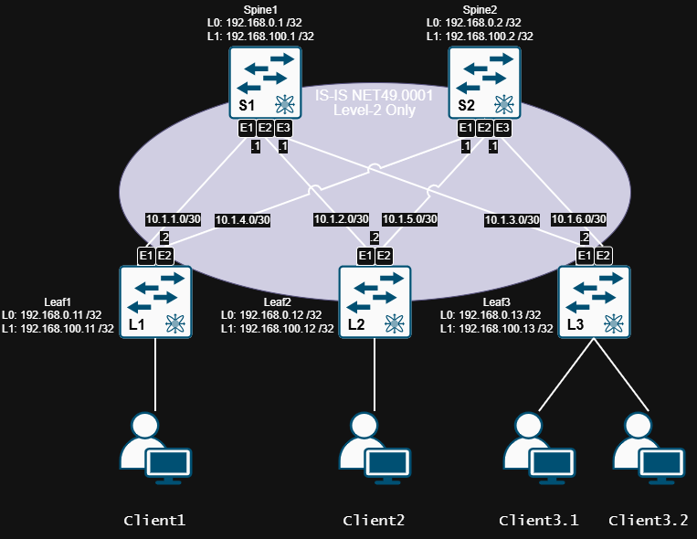

# Lab03.Построение Underlay сети (IS-IS)
> «Протокол IS-IS — это как старый, надежный швейцарский армейский нож в мире сетевой маршрутизации: никто толком не понимает, зачем там столько лезвий и почему они называются TLV, но если вам нужно построить магистраль операторского класса прямо в ад и обратно, вы берете именно его, тихонько молясь, чтобы OSPF не узнал об этой измене»

## 1. Цель работы
1. Настроить IS-IS в Underlay сети, для IP связанности между всеми сетевыми устройствами;
2. Зафиксировать в документации - план работы, адресное пространство, схему сети, конфигурацию устройств;
3. Убедиться в наличии IP связанности между устройствами в IS-IS домене.

## 2. Топология


| Device     | Hostname  | Platform        | Interface Loopback | IP network /32 |
|------------|-----------|-----------------| -------------------|----------------|
| Spine1     | S1        | Arista vEOS-lab | Loopback 0         | 192.168.0.1    |
| Spine1     | S1        | Arista vEOS-lab | Loopback 1         | 192.168.100.1  |
| Spine2     | S2        | Arista vEOS-lab | Loopback 0         | 192.168.0.2    |
| Spine2     | S2        | Arista vEOS-lab | Loopback 1         | 192.168.100.2  |
| Leaf1      | L1        | Arista vEOS-lab | Loopback 0         | 192.168.0.11   |
| Leaf1      | L1        | Arista vEOS-lab | Loopback 1         | 192.168.100.11 |
| Leaf2      | L2        | Arista vEOS-lab | Loopback 0         | 192.168.0.12   |
| Leaf2      | L2        | Arista vEOS-lab | Loopback 1         | 192.168.100.12 |
| Leaf3      | L3        | Arista vEOS-lab | Loopback 0         | 192.168.0.13   |
| Leaf3      | L3        | Arista vEOS-lab | Loopback 1         | 192.168.100.13 |

## 3. Адресный план (Underlay)


| Device1    | Interface1   | Device1 IP | Network /30 | Device2 IP | Interface2   | Device2    |
|------------|--------------|------------|-------------|------------|--------------|------------|
| Leaf1      | Ethernet1    |  10.1.1.2  |  10.1.1.0   |  10.1.1.1  | Ethernet1    | Spine1     |
| Leaf1      | Ethernet2    |  10.1.4.2  |  10.1.4.0   |  10.1.4.1  | Ethernet1    | Spine2     |
| Leaf2      | Ethernet1    |  10.1.2.2  |  10.1.2.0   |  10.1.2.1  | Ethernet2    | Spine1     |
| Leaf2      | Ethernet2    |  10.1.5.2  |  10.1.5.0   |  10.1.5.1  | Ethernet2    | Spine2     |
| Leaf3      | Ethernet1    |  10.1.3.2  |  10.1.3.0   |  10.1.3.1  | Ethernet3    | Spine1     |
| Leaf3      | Ethernet2    |  10.1.6.2  |  10.1.6.0   |  10.1.6.1  | Ethernet3    | Spine2     |


## 4. Конфигурация 

| Device    | System-ID      | NET                       |
|-----------|----------------|---------------------------|
| Spine1    | 1010.2550.0001 | 49.0001.1010.2550.0001.00 |
| Spine2    | 1010.2550.0002 | 49.0001.1010.2550.0002.00 |
| Leaf1     | 1010.2550.0011 | 49.0001.1010.2550.0011.00 |
| Leaf2     | 1010.2550.0012 | 49.0001.1010.2550.0012.00 |
| Leaf3     | 1010.2550.0013 | 49.0001.1010.2550.0013.00 |

<details>
<summary> Spine1
</summary>

```
hostname Spine1
!
interface Loopback0
   ip address 192.168.0.1/32
   isis enable DC-UNDERLAY
   isis passive
   exit
!
interface Ethernet1
   description P2P_to_Leaf1_Eth1
   no switchport
   mtu 9000
   ip address 10.1.1.1/30
   isis enable DC-UNDERLAY
   isis network point-to-point
   isis authentication mode md5
   isis authentication key OTUS
   bfd interval 300 min-rx 300 multiplier 3
   isis bfd
   exit
!
interface Ethernet2
   description P2P_to_Leaf2_Eth1
   no switchport
   mtu 9000
   ip address 10.1.2.1/30
   isis enable DC-UNDERLAY
   isis network point-to-point
   isis authentication mode md5
   isis authentication key OTUS
   bfd interval 300 min-rx 300 multiplier 3
   isis bfd
   exit
!
interface Ethernet3
   description P2P_to_Leaf3_Eth1
   no switchport
   mtu 9000
   ip address 10.1.3.1/30
   isis enable DC-UNDERLAY
   isis network point-to-point
   isis authentication mode md5
   isis authentication key OTUS
   bfd interval 300 min-rx 300 multiplier 3
   isis bfd
   exit
!
router isis DC-UNDERLAY
   net 49.0001.1010.2550.0001.00
   is-type level-2
   log-adjacency-changes
   authentication mode md5 level-2
   authentication key OTUS level-2
   spf-interval 1 50 200
   address-family ipv4 unicast
      maximum-paths 4
	  exit
   exit
```

</details>

[Spine1 Running-conifg ](_Spine1_running-config.txt)

<details>
<summary> Spine2
</summary>

```
hostname Spine2
!
interface Loopback0
   ip address 192.168.0.2/32
   isis enable DC-UNDERLAY
   isis passive
   exit
!
interface Ethernet1
   description P2P_to_Leaf1_Eth2
   no switchport
   mtu 9000
   ip address 10.1.4.1/30
   isis enable DC-UNDERLAY
   isis network point-to-point
   isis authentication mode md5
   isis authentication key OTUS
   bfd interval 300 min-rx 300 multiplier 3
   isis bfd
   exit
!
interface Ethernet2
   description P2P_to_Leaf2_Eth2
   no switchport
   mtu 9000
   ip address 10.1.5.1/30
   isis enable DC-UNDERLAY
   isis network point-to-point
   isis authentication mode md5
   isis authentication key OTUS
   bfd interval 300 min-rx 300 multiplier 3
   isis bfd
   exit
!
interface Ethernet3
   description P2P_to_Leaf3_Eth2
   no switchport
   mtu 9000
   ip address 10.1.6.1/30
   isis enable DC-UNDERLAY
   isis network point-to-point
   isis authentication mode md5
   isis authentication key OTUS
   bfd interval 300 min-rx 300 multiplier 3
   isis bfd
   exit
!
router isis DC-UNDERLAY
   net 49.0001.1010.2550.0002.00
   is-type level-2
   log-adjacency-changes
   authentication mode md5 level-2
   authentication key OTUS level-2
   spf-interval 1 50 200
   address-family ipv4 unicast
      maximum-paths 4
	  exit
   exit
```

</details>

[Spine2 Running-conifg ](_Spine2_running-config.txt)

<details>
<summary> Leaf1
</summary>

```
hostname Leaf1
!
interface Loopback0
   ip address 192.168.0.11/32
   isis enable DC-UNDERLAY
   isis passive
   exit
!
interface Ethernet1
   description P2P_to_Spine1_Eth1
   no switchport
   mtu 9000
   ip address 10.1.1.2/30
   isis enable DC-UNDERLAY
   isis network point-to-point
   isis authentication mode md5
   isis authentication key OTUS
   bfd interval 300 min-rx 300 multiplier 3
   isis bfd
   exit
!
interface Ethernet2
   description P2P_to_Spine2_Eth1
   no switchport
   mtu 9000
   ip address 10.1.4.2/30
   isis enable DC-UNDERLAY
   isis network point-to-point
   isis authentication mode md5
   isis authentication key OTUS
   bfd interval 300 min-rx 300 multiplier 3
   isis bfd
   exit
!
interface Ethernet8
   description To_Client1
   exit
!
router isis DC-UNDERLAY
   net 49.0001.1010.2550.0011.00
   is-type level-2
   log-adjacency-changes
   authentication mode md5 level-2
   authentication key OTUS level-2
   spf-interval 1 50 200
   address-family ipv4 unicast
      maximum-paths 4
	  exit
   exit
```

</details>

[Leaf1 Running-conifg ](_Leaf1_running-config.txt)

<details>
<summary> Leaf2
</summary>

```
hostname Leaf2
!
interface Loopback0
   ip address 192.168.0.12/32
   isis enable DC-UNDERLAY
   isis passive
   exit
!
interface Ethernet1
   description P2P_to_Spine1_Eth2
   no switchport
   mtu 9000
   ip address 10.1.2.2/30
   isis enable DC-UNDERLAY
   isis network point-to-point
   isis authentication mode md5
   isis authentication key OTUS
   bfd interval 300 min-rx 300 multiplier 3
   isis bfd
   exit
!
interface Ethernet2
   description P2P_to_Spine2_Eth2
   no switchport
   mtu 9000
   ip address 10.1.5.2/30
   isis enable DC-UNDERLAY
   isis network point-to-point
   isis authentication mode md5
   isis authentication key OTUS
   bfd interval 300 min-rx 300 multiplier 3
   isis bfd
   exit
!
interface Ethernet8
   description To_Client2
   exit
!
router isis DC-UNDERLAY
   net 49.0001.1010.2550.0012.00
   is-type level-2
   log-adjacency-changes
   authentication mode md5 level-2
   authentication key OTUS level-2
   spf-interval 1 50 200
   address-family ipv4 unicast
      maximum-paths 4
	  exit
   exit
```

</details>

[Leaf2 Running-conifg ](_Leaf2_running-config.txt)

<details>
<summary> Leaf3
</summary>

```
hostname Leaf3
!
interface Loopback0
   ip address 192.168.0.13/32
   isis enable DC-UNDERLAY
   isis passive
   exit
!
interface Ethernet1
   description P2P_to_Spine1_Eth3
   no switchport
   mtu 9000
   ip address 10.1.3.2/30
   isis enable DC-UNDERLAY
   isis network point-to-point
   isis authentication mode md5
   isis authentication key OTUS
   bfd interval 300 min-rx 300 multiplier 3
   isis bfd
   exit
!
interface Ethernet2
   description P2P_to_Spine2_Eth3
   no switchport
   mtu 9000
   ip address 10.1.6.2/30
   isis enable DC-UNDERLAY
   isis network point-to-point
   isis authentication mode md5
   isis authentication key OTUS
   bfd interval 300 min-rx 300 multiplier 3
   isis bfd
   exit
!
interface Ethernet7
   description To_Client3.1
   exit
!
interface Ethernet8
   description To_Client3.2
   exit
!
router isis DC-UNDERLAY
   net 49.0001.1010.2550.0013.00
   is-type level-2
   log-adjacency-changes
   authentication mode md5 level-2
   authentication key OTUS level-2
   spf-interval 1 50 200
   address-family ipv4 unicast
      maximum-paths 4
	  exit
   exit
```

</details>

[Leaf3 Running-conifg ](_Leaf3_running-config.txt)

<details>
<summary> Monitoring/Debug
</summary>

```
show isis interface brief
show isis neighbors
show isis summary
show isis database detail
show ip route isis
show bfd peers

debug isis adjacency-events
debug isis spf-events
```

</details>

## 5. Проверка работоспособности топологии

<details>
<summary> Проверка работы протоколов на S1
</summary>

```
Spine1#show isis interface brief

IS-IS Instance: DC-UNDERLAY VRF: default

Interface Level IPv4 Metric IPv6 Metric Type           Adjacency
--------- ----- ----------- ----------- -------------- ---------
Loopback0 L2             10          10 loopback       (passive)
Ethernet1 L2             10          10 point-to-point         1
Ethernet2 L2             10          10 point-to-point         1
Ethernet3 L2             10          10 point-to-point         1

Spine1#show isis neighbors
 
Instance  VRF      System Id        Type Interface          SNPA              State Hold time   Circuit Id          
DC-UNDERL default  Leaf1            L2   Ethernet1          P2P               UP    27          0F                  
DC-UNDERL default  Leaf2            L2   Ethernet2          P2P               UP    30          0F                  
DC-UNDERL default  Leaf3            L2   Ethernet3          P2P               UP    23          0F

Spine1#show isis summary
 
IS-IS Instance: DC-UNDERLAY VRF: default
  Instance ID: 0
  System ID: 1010.2550.0001, administratively enabled
  Router ID: IPv4: 192.168.100.1
  Hostname: Spine1
  Multi Topology disabled, not attached
  IPv4 Preference: Level 1: 115, Level 2: 115
  IPv6 Preference: Level 1: 115, Level 2: 115
  IS-Type: Level 2, Number active interfaces: 4
  Routes IPv4 only
  LSP size maximum: Level 1: 1492, Level 2: 1492
                            Max wait(s) Initial wait(ms) Hold interval(ms)
  LSP Generation Interval:     5              50               50
  SPF Interval:                1              50              200
  Current SPF hold interval(ms): Level 1: 0, Level 2: 200
  Last Level 2 SPF run 3:24 minutes ago
  CSNP generation interval: 10 seconds
  Dynamic Flooding: Disabled
  Authentication mode: Level 1: None, Level 2: MD5
  Graceful Restart: Disabled, Graceful Restart Helper: Enabled
  Area addresses: 49.0001
  level 2: number DIS interfaces: 0, LSDB size: 5
    Area Leader: None
    Overload Bit is not set. 
  Redistributed Level 1 routes: 0 limit: Not Configured
  Redistributed Level 2 routes: 0 limit: Not Configured
Spine1#show isis database detail

IS-IS Instance: DC-UNDERLAY VRF: default
  IS-IS Level 2 Link State Database
    LSPID                   Seq Num  Cksum  Life Length IS Flags
    Spine1.00-00                 13  59001   994    165 L2 <>
      LSP generation remaining wait time: 0 ms
      Time remaining until refresh: 694 s
      NLPID: 0xCC(IPv4)
      Hostname: Spine1
      Authentication mode: MD5 Length: 17
      Area addresses: 49.0001
      Interface address: 10.1.3.1
      Interface address: 10.1.2.1
      Interface address: 10.1.1.1
      Interface address: 192.168.0.1
      IS Neighbor          : Leaf3.00            Metric: 10
      IS Neighbor          : Leaf1.00            Metric: 10
      IS Neighbor          : Leaf2.00            Metric: 10
      Reachability         : 10.1.3.0/30 Metric: 10 Type: 1 Up
      Reachability         : 10.1.2.0/30 Metric: 10 Type: 1 Up
      Reachability         : 10.1.1.0/30 Metric: 10 Type: 1 Up
      Reachability         : 192.168.0.1/32 Metric: 10 Type: 1 Up
      Router Capabilities: Router Id: 192.168.100.1 Flags: []
        Area leader priority: 250 algorithm: 0
    Spine2.00-00                 13   1609  1021    165 L2 <>
      Remaining lifetime received: 1199 s Modified to: 1200 s
      NLPID: 0xCC(IPv4)
      Hostname: Spine2
      Authentication mode: MD5 Length: 17
      Area addresses: 49.0001
      Interface address: 10.1.6.1
      Interface address: 10.1.5.1
      Interface address: 10.1.4.1
      Interface address: 192.168.0.2
      IS Neighbor          : Leaf1.00            Metric: 10
      IS Neighbor          : Leaf2.00            Metric: 10
      IS Neighbor          : Leaf3.00            Metric: 10
      Reachability         : 10.1.6.0/30 Metric: 10 Type: 1 Up
      Reachability         : 10.1.5.0/30 Metric: 10 Type: 1 Up
      Reachability         : 10.1.4.0/30 Metric: 10 Type: 1 Up
      Reachability         : 192.168.0.2/32 Metric: 10 Type: 1 Up
      Router Capabilities: Router Id: 192.168.100.2 Flags: []
        Area leader priority: 250 algorithm: 0
    Leaf1.00-00                  10  21807  1116    140 L2 <>
      Remaining lifetime received: 1199 s Modified to: 1200 s
      NLPID: 0xCC(IPv4)
      Hostname: Leaf1
      Authentication mode: MD5 Length: 17
      Area addresses: 49.0001
      Interface address: 10.1.4.2
      Interface address: 10.1.1.2
      Interface address: 192.168.0.11
      IS Neighbor          : Spine2.00           Metric: 10
      IS Neighbor          : Spine1.00           Metric: 10
      Reachability         : 10.1.4.0/30 Metric: 10 Type: 1 Up
      Reachability         : 10.1.1.0/30 Metric: 10 Type: 1 Up
      Reachability         : 192.168.0.11/32 Metric: 10 Type: 1 Up
      Router Capabilities: Router Id: 192.168.100.11 Flags: []
        Area leader priority: 250 algorithm: 0
    Leaf2.00-00                   9  54488  1070    140 L2 <>
      Remaining lifetime received: 1199 s Modified to: 1200 s
      NLPID: 0xCC(IPv4)
      Hostname: Leaf2
      Authentication mode: MD5 Length: 17
      Area addresses: 49.0001
      Interface address: 10.1.2.2
      Interface address: 10.1.5.2
      Interface address: 192.168.0.12
      IS Neighbor          : Spine2.00           Metric: 10
      IS Neighbor          : Spine1.00           Metric: 10
      Reachability         : 10.1.2.0/30 Metric: 10 Type: 1 Up
      Reachability         : 10.1.5.0/30 Metric: 10 Type: 1 Up
      Reachability         : 192.168.0.12/32 Metric: 10 Type: 1 Up
      Router Capabilities: Router Id: 192.168.100.12 Flags: []
        Area leader priority: 250 algorithm: 0
    Leaf3.00-00                  10  27974  1139    140 L2 <>
      Remaining lifetime received: 1199 s Modified to: 1200 s
      NLPID: 0xCC(IPv4)
      Hostname: Leaf3
      Authentication mode: MD5 Length: 17
      Area addresses: 49.0001
      Interface address: 10.1.3.2
      Interface address: 10.1.6.2
      Interface address: 192.168.0.13
      IS Neighbor          : Spine1.00           Metric: 10
      IS Neighbor          : Spine2.00           Metric: 10
      Reachability         : 10.1.3.0/30 Metric: 10 Type: 1 Up
      Reachability         : 10.1.6.0/30 Metric: 10 Type: 1 Up
      Reachability         : 192.168.0.13/32 Metric: 10 Type: 1 Up
      Router Capabilities: Router Id: 192.168.100.13 Flags: []
        Area leader priority: 250 algorithm: 0

Spine1#show ip route isis

VRF: default
Codes: C - connected, S - static, K - kernel, 
       O - OSPF, IA - OSPF inter area, E1 - OSPF external type 1,
       E2 - OSPF external type 2, N1 - OSPF NSSA external type 1,
       N2 - OSPF NSSA external type2, B - Other BGP Routes,
       B I - iBGP, B E - eBGP, R - RIP, I L1 - IS-IS level 1,
       I L2 - IS-IS level 2, O3 - OSPFv3, A B - BGP Aggregate,
       A O - OSPF Summary, NG - Nexthop Group Static Route,
       V - VXLAN Control Service, M - Martian,
       DH - DHCP client installed default route,
       DP - Dynamic Policy Route, L - VRF Leaked,
       G  - gRIBI, RC - Route Cache Route

 I L2     10.1.4.0/30 [115/20] via 10.1.1.2, Ethernet1
 I L2     10.1.5.0/30 [115/20] via 10.1.2.2, Ethernet2
 I L2     10.1.6.0/30 [115/20] via 10.1.3.2, Ethernet3
 I L2     192.168.0.2/32 [115/30] via 10.1.1.2, Ethernet1
                                  via 10.1.2.2, Ethernet2
                                  via 10.1.3.2, Ethernet3
 I L2     192.168.0.11/32 [115/20] via 10.1.1.2, Ethernet1
 I L2     192.168.0.12/32 [115/20] via 10.1.2.2, Ethernet2
 I L2     192.168.0.13/32 [115/20] via 10.1.3.2, Ethernet3

Spine1#show bfd peers
VRF name: default
-----------------
DstAddr       MyDisc    YourDisc  Interface/Transport    Type           LastUp 
--------- ----------- ----------- -------------------- ------- ----------------
10.1.1.2  2825160312  4102709427        Ethernet1(15)  normal   09/15/26 10:37 
10.1.2.2  2224517618  3276342920        Ethernet2(16)  normal   09/15/26 10:37 
10.1.3.2   951628117  1030519387        Ethernet3(17)  normal   09/15/26 10:37 

   LastDown            LastDiag    State
-------------- ------------------- -----
         NA       No Diagnostic       Up
         NA       No Diagnostic       Up
         NA       No Diagnostic       Up
```

</details>

<details>
<summary> Проверка работы протоколов на S2
</summary>

```
Spine2#show isis interface brief

Interface Level IPv4 Metric IPv6 Metric Type           Adjacency
--------- ----- ----------- ----------- -------------- ---------
Loopback0 L2             10          10 loopback       (passive)
Ethernet1 L2             10          10 point-to-point         1
Ethernet2 L2             10          10 point-to-point         1
Ethernet3 L2             10          10 point-to-point         1

Spine2#show isis neighbors
 
Instance  VRF      System Id        Type Interface          SNPA              State Hold time   Circuit Id          
DC-UNDERL default  Leaf1            L2   Ethernet1          P2P               UP    28          10                  
DC-UNDERL default  Leaf2            L2   Ethernet2          P2P               UP    27          10                  
DC-UNDERL default  Leaf3            L2   Ethernet3          P2P               UP    29          10                  

Spine2#show isis summary
 
IS-IS Instance: DC-UNDERLAY VRF: default
  Instance ID: 0
  System ID: 1010.2550.0002, administratively enabled
  Router ID: IPv4: 192.168.100.2
  Hostname: Spine2
  Multi Topology disabled, not attached
  IPv4 Preference: Level 1: 115, Level 2: 115
  IPv6 Preference: Level 1: 115, Level 2: 115
  IS-Type: Level 2, Number active interfaces: 4
  Routes IPv4 only
  LSP size maximum: Level 1: 1492, Level 2: 1492
                            Max wait(s) Initial wait(ms) Hold interval(ms)
  LSP Generation Interval:     5              50               50
  SPF Interval:                1              50              200
  Current SPF hold interval(ms): Level 1: 0, Level 2: 200
  Last Level 2 SPF run 5:41 minutes ago
  CSNP generation interval: 10 seconds
  Dynamic Flooding: Disabled
  Authentication mode: Level 1: None, Level 2: MD5
  Graceful Restart: Disabled, Graceful Restart Helper: Enabled
  Area addresses: 49.0001
  level 2: number DIS interfaces: 0, LSDB size: 5
    Area Leader: None
    Overload Bit is not set. 
  Redistributed Level 1 routes: 0 limit: Not Configured
  Redistributed Level 2 routes: 0 limit: Not Configured

Spine2#show isis database detail

IS-IS Instance: DC-UNDERLAY VRF: default
  IS-IS Level 2 Link State Database
    LSPID                   Seq Num  Cksum  Life Length IS Flags
    Spine1.00-00                 13  59001   832    165 L2 <>
      Remaining lifetime received: 1199 s Modified to: 1200 s
      NLPID: 0xCC(IPv4)
      Hostname: Spine1
      Authentication mode: MD5 Length: 17
      Area addresses: 49.0001
      Interface address: 10.1.3.1
      Interface address: 10.1.2.1
      Interface address: 10.1.1.1
      Interface address: 192.168.0.1
      IS Neighbor          : Leaf3.00            Metric: 10
      IS Neighbor          : Leaf1.00            Metric: 10
      IS Neighbor          : Leaf2.00            Metric: 10
      Reachability         : 10.1.3.0/30 Metric: 10 Type: 1 Up
      Reachability         : 10.1.2.0/30 Metric: 10 Type: 1 Up
      Reachability         : 10.1.1.0/30 Metric: 10 Type: 1 Up
      Reachability         : 192.168.0.1/32 Metric: 10 Type: 1 Up
      Router Capabilities: Router Id: 192.168.100.1 Flags: []
        Area leader priority: 250 algorithm: 0
    Spine2.00-00                 13   1609   858    165 L2 <>
      LSP generation remaining wait time: 0 ms
      Time remaining until refresh: 558 s
      NLPID: 0xCC(IPv4)
      Hostname: Spine2
      Authentication mode: MD5 Length: 17
      Area addresses: 49.0001
      Interface address: 10.1.6.1
      Interface address: 10.1.5.1
      Interface address: 10.1.4.1
      Interface address: 192.168.0.2
      IS Neighbor          : Leaf1.00            Metric: 10
      IS Neighbor          : Leaf2.00            Metric: 10
      IS Neighbor          : Leaf3.00            Metric: 10
      Reachability         : 10.1.6.0/30 Metric: 10 Type: 1 Up
      Reachability         : 10.1.5.0/30 Metric: 10 Type: 1 Up
      Reachability         : 10.1.4.0/30 Metric: 10 Type: 1 Up
      Reachability         : 192.168.0.2/32 Metric: 10 Type: 1 Up
      Router Capabilities: Router Id: 192.168.100.2 Flags: []
        Area leader priority: 250 algorithm: 0
    Leaf1.00-00                  10  21807   954    140 L2 <>
      Remaining lifetime received: 1199 s Modified to: 1200 s
      NLPID: 0xCC(IPv4)
      Hostname: Leaf1
      Authentication mode: MD5 Length: 17
      Area addresses: 49.0001
      Interface address: 10.1.4.2
      Interface address: 10.1.1.2
      Interface address: 192.168.0.11
      IS Neighbor          : Spine2.00           Metric: 10
      IS Neighbor          : Spine1.00           Metric: 10
      Reachability         : 10.1.4.0/30 Metric: 10 Type: 1 Up
      Reachability         : 10.1.1.0/30 Metric: 10 Type: 1 Up
      Reachability         : 192.168.0.11/32 Metric: 10 Type: 1 Up
      Router Capabilities: Router Id: 192.168.100.11 Flags: []
        Area leader priority: 250 algorithm: 0
    Leaf2.00-00                   9  54488   907    140 L2 <>
      Remaining lifetime received: 1199 s Modified to: 1200 s
      NLPID: 0xCC(IPv4)
      Hostname: Leaf2
      Authentication mode: MD5 Length: 17
      Area addresses: 49.0001
      Interface address: 10.1.2.2
      Interface address: 10.1.5.2
      Interface address: 192.168.0.12
      IS Neighbor          : Spine2.00           Metric: 10
      IS Neighbor          : Spine1.00           Metric: 10
      Reachability         : 10.1.2.0/30 Metric: 10 Type: 1 Up
      Reachability         : 10.1.5.0/30 Metric: 10 Type: 1 Up
      Reachability         : 192.168.0.12/32 Metric: 10 Type: 1 Up
      Router Capabilities: Router Id: 192.168.100.12 Flags: []
        Area leader priority: 250 algorithm: 0
    Leaf3.00-00                  10  27974   976    140 L2 <>
      Remaining lifetime received: 1199 s Modified to: 1200 s
      NLPID: 0xCC(IPv4)
      Hostname: Leaf3
      Authentication mode: MD5 Length: 17
      Area addresses: 49.0001
      Interface address: 10.1.3.2
      Interface address: 10.1.6.2
      Interface address: 192.168.0.13
      IS Neighbor          : Spine1.00           Metric: 10
      IS Neighbor          : Spine2.00           Metric: 10
      Reachability         : 10.1.3.0/30 Metric: 10 Type: 1 Up
      Reachability         : 10.1.6.0/30 Metric: 10 Type: 1 Up
      Reachability         : 192.168.0.13/32 Metric: 10 Type: 1 Up
      Router Capabilities: Router Id: 192.168.100.13 Flags: []
        Area leader priority: 250 algorithm: 0

Spine2#show ip route isis

VRF: default
Codes: C - connected, S - static, K - kernel, 
       O - OSPF, IA - OSPF inter area, E1 - OSPF external type 1,
       E2 - OSPF external type 2, N1 - OSPF NSSA external type 1,
       N2 - OSPF NSSA external type2, B - Other BGP Routes,
       B I - iBGP, B E - eBGP, R - RIP, I L1 - IS-IS level 1,
       I L2 - IS-IS level 2, O3 - OSPFv3, A B - BGP Aggregate,
       A O - OSPF Summary, NG - Nexthop Group Static Route,
       V - VXLAN Control Service, M - Martian,
       DH - DHCP client installed default route,
       DP - Dynamic Policy Route, L - VRF Leaked,
       G  - gRIBI, RC - Route Cache Route

 I L2     10.1.1.0/30 [115/20] via 10.1.4.2, Ethernet1
 I L2     10.1.2.0/30 [115/20] via 10.1.5.2, Ethernet2
 I L2     10.1.3.0/30 [115/20] via 10.1.6.2, Ethernet3
 I L2     192.168.0.1/32 [115/30] via 10.1.4.2, Ethernet1
                                  via 10.1.5.2, Ethernet2
                                  via 10.1.6.2, Ethernet3
 I L2     192.168.0.11/32 [115/20] via 10.1.4.2, Ethernet1
 I L2     192.168.0.12/32 [115/20] via 10.1.5.2, Ethernet2
 I L2     192.168.0.13/32 [115/20] via 10.1.6.2, Ethernet3

Spine2#show bfd peers

VRF name: default
-----------------
DstAddr       MyDisc    YourDisc  Interface/Transport    Type           LastUp 
--------- ----------- ----------- -------------------- ------- ----------------
10.1.4.2  2892952373  1888005219        Ethernet1(15)  normal   09/15/26 10:37 
10.1.5.2  2056098945  2477695551        Ethernet2(16)  normal   09/15/26 10:37 
10.1.6.2  1285352338  2260419750        Ethernet3(17)  normal   09/15/26 10:37 

   LastDown            LastDiag    State
-------------- ------------------- -----
         NA       No Diagnostic       Up
         NA       No Diagnostic       Up
         NA       No Diagnostic       Up
```

</details>

<details>
<summary> Проверка доступности L1 <--> L2
</summary>

```
Leaf1#ping 192.168.0.12 repeat 1
PING 192.168.0.12 (192.168.0.12) 72(100) bytes of data.
80 bytes from 192.168.0.12: icmp_seq=1 ttl=63 time=23.8 ms

--- 192.168.0.12 ping statistics ---
1 packets transmitted, 1 received, 0% packet loss, time 0ms
rtt min/avg/max/mdev = 23.866/23.866/23.866/0.000 ms
```

</details>

<details>
<summary> Проверка доступности L1 <--> L3
</summary>

```
Leaf1#ping 192.168.0.13 repeat 1
PING 192.168.0.13 (192.168.0.13) 72(100) bytes of data.
80 bytes from 192.168.0.13: icmp_seq=1 ttl=63 time=18.3 ms

--- 192.168.0.13 ping statistics ---
1 packets transmitted, 1 received, 0% packet loss, time 0ms
rtt min/avg/max/mdev = 18.316/18.316/18.316/0.000 ms
```

</details>

<details>
<summary> Проверка доступности L2 <--> L3
</summary>

```
Leaf2#ping 192.168.0.13 repeat 1
PING 192.168.0.13 (192.168.0.13) 72(100) bytes of data.
80 bytes from 192.168.0.13: icmp_seq=1 ttl=63 time=62.2 ms

--- 192.168.0.13 ping statistics ---
1 packets transmitted, 1 received, 0% packet loss, time 0ms
rtt min/avg/max/mdev = 62.234/62.234/62.234/0.000 ms
```

</details>