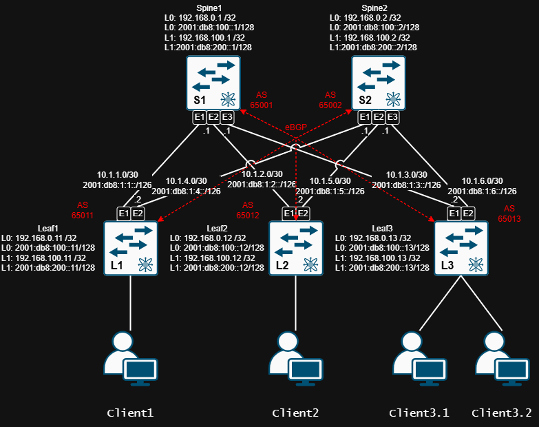

# Lab03.Построение Underlay сети (eBGP)
> «»

## 1. Цель работы
1. 
2. 
3. 

## 2. Топология


| Device     | Hostname  | Platform        | Interface Loopback | IP network /32 |
|------------|-----------|-----------------| -------------------|----------------|
| Spine1     | S1        | Arista vEOS-lab | Loopback 0         | 192.168.0.1    |
| Spine1     | S1        | Arista vEOS-lab | Loopback 1         | 192.168.100.1  |
| Spine2     | S2        | Arista vEOS-lab | Loopback 0         | 192.168.0.2    |
| Spine2     | S2        | Arista vEOS-lab | Loopback 1         | 192.168.100.2  |
| Leaf1      | L1        | Arista vEOS-lab | Loopback 0         | 192.168.0.11   |
| Leaf1      | L1        | Arista vEOS-lab | Loopback 1         | 192.168.100.11 |
| Leaf2      | L2        | Arista vEOS-lab | Loopback 0         | 192.168.0.12   |
| Leaf2      | L2        | Arista vEOS-lab | Loopback 1         | 192.168.100.12 |
| Leaf3      | L3        | Arista vEOS-lab | Loopback 0         | 192.168.0.13   |
| Leaf3      | L3        | Arista vEOS-lab | Loopback 1         | 192.168.100.13 |

## 3. Адресный план (Underlay)


| Device1    | Interface1   | Device1 IP | Network /30 | Device2 IP | Interface2   | Device2    |
|------------|--------------|------------|-------------|------------|--------------|------------|
| Leaf1      | Ethernet1    |  10.1.1.2  |  10.1.1.0   |  10.1.1.1  | Ethernet1    | Spine1     |
| Leaf1      | Ethernet2    |  10.1.4.2  |  10.1.4.0   |  10.1.4.1  | Ethernet1    | Spine2     |
| Leaf2      | Ethernet1    |  10.1.2.2  |  10.1.2.0   |  10.1.2.1  | Ethernet2    | Spine1     |
| Leaf2      | Ethernet2    |  10.1.5.2  |  10.1.5.0   |  10.1.5.1  | Ethernet2    | Spine2     |
| Leaf3      | Ethernet1    |  10.1.3.2  |  10.1.3.0   |  10.1.3.1  | Ethernet3    | Spine1     |
| Leaf3      | Ethernet2    |  10.1.6.2  |  10.1.6.0   |  10.1.6.1  | Ethernet3    | Spine2     |

## 4. Конфигурация 

<details>
<summary> Spine1
</summary>

```

```

</details>

[Spine1 Running-conifg ](_Spine1_running-config.txt)

<details>
<summary> Spine2
</summary>

```

```

</details>

[Spine2 Running-conifg ](_Spine2_running-config.txt)

<details>
<summary> Leaf1
</summary>

```

```

</details>

[Leaf1 Running-conifg ](_Leaf1_running-config.txt)

<details>
<summary> Leaf2
</summary>

```

```

</details>

[Leaf2 Running-conifg ](_Leaf2_running-config.txt)

<details>
<summary> Leaf3
</summary>

```

```

</details>

[Leaf3 Running-conifg ](_Leaf3_running-config.txt)

<details>
<summary> Monitoring/Debug
</summary>

```

```

</details>

## 5. Проверка работоспособности топологии

<details>
<summary> Проверка работы протоколов на S1
</summary>

```

```

</details>

<details>
<summary> Проверка работы протоколов на S2
</summary>

```

```

</details>

<details>
<summary> Проверка доступности L1 <--> L2
</summary>

```

```

</details>

<details>
<summary> Проверка доступности L1 <--> L3
</summary>

```

```

</details>

<details>
<summary> Проверка доступности L2 <--> L3
</summary>

```

```

</details>